## 基本工具安装配置

### 特别说明

* 文档所列举到的工具软件类型及版本，操作过程等，皆以实际操作过程涉及相关为参考，如果你是新手建议一步步按照文档进行，如果你是熟手你可以参考相关描述直接在现有熟悉的环境自行配置。

* 除特殊说明以外，以下教程假定相关软件或项目的操作根目录为：DEV_DIR=D:\projects\training\s2jh4net，另外，**部分截图来源于其他项目内容，请注意参考本教程相关描述对应调整**。

### JDK版本及安装

从Oracle官方下载JDK 7版本，本教程采用Windows 64位jdk1.7.0_45。默认安装路径为：C:\Program Files\Java\jdk1.7.0_45。目前已知Markdown4jProcessor在JDK6环境不支持，其余版本未做实际验证，可能存在未知的兼容问题，因此建议优先采用JDK 7版本。

### Eclipse IDE / Spring Tool Suite

本教程采用Windows 64位spring-tool-suite 3.6.3.RELEASE（以下简称STS），下载安装文件名为 spring-tool-suite-3.6.3.RELEASE-e4.4.1-win32-x86_64.zip。
具体可访问 http://spring.io/tools/sts/  或   http://spring.io/tools/sts/legacy  下载STS最新版本或本教程对应版本。

下载压缩文件后，创建${DEV_DIR}\tools目录，并把zip文件直接拷贝到tools目录，然后点击右键解压缩工具（本教程使用7-zip工具）“解压缩到当前文件夹...”，得到本地${DEV_DIR}\tools\sts-bundle。

**重要提示：**建议不要采用直接双击打开压缩包然后拖放到目录的操作方式，而是通过解压软件的右键菜单直接选取“解压到当前文件夹”方式，否则在Windows环境下很可能遇到抛出文件路径过长的错误。

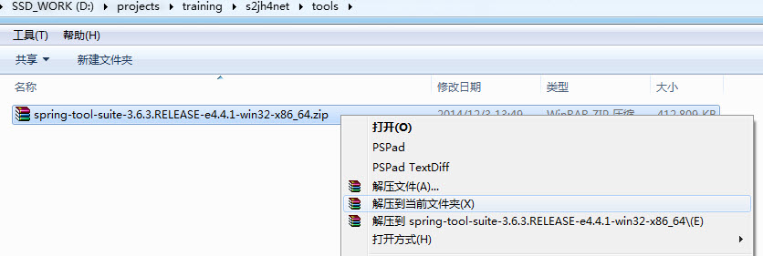

即便通过直接解压的方式，也可能出现如下类似路径过程的错误，可以忽略，不影响IDE的功能使用：

```
!   D:\projects\training\s2jh4net\tools\spring-tool-suite-3.6.3.RELEASE-e4.4.1-win32-x86_64.zip: 
无法创建 sts-bundle\sts-3.6.3.RELEASE\plugins\org.springsource.ide.eclipse.commons.gettingstarted_3.6.3.201411271001-RELEASE
\org\springsource\ide\eclipse\commons\gettingstarted\dashboard\ExtensionsEditor$DashboardDiscoveryViewer.class
    路径和文件名总长度必须不能超过 260 个字符
```
 
### Apache Maven安装配置

目前框架和教程实际验证过的采用apache-maven-3.0.5版本，按照官方的说法 “This is a stable version 3.0.x of Maven for projects that can't upgrade to Maven 3.2 yet.” ，其他Maven版本可能存在位置的兼容性问题。具体可访问 http://maven.apache.org/download.cgi 下载3.0.5版本。

下载后如下图路径解压目录，${DEV_DIR}\tools\apache-maven-3.0.5：

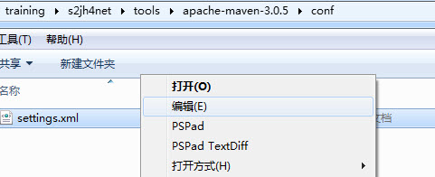

然后是本地资源库配置（提示：如果你熟悉Maven的使用并且本地已经有自己的本地资源库目录，则直接指向已有目录即可），首先在系统资源管理器操作创建本地资源库目录：${DEV_DIR}\tools\repository，然后编辑settings.xml配置文件设置Maven本地资源库目录，取消注释并设定：

```
<localRepository>D:\projects\training\s2jh4net\tools\repository</localRepository>
```

### Eclipse 插件安装配置
 
启动STS（${DEV_DIR}\tools\sts-bundle\sts-3.6.3.RELEASE\STS.exe），设定工作空间为${DEV_DIR}\workspace，切换到Java EE视图。

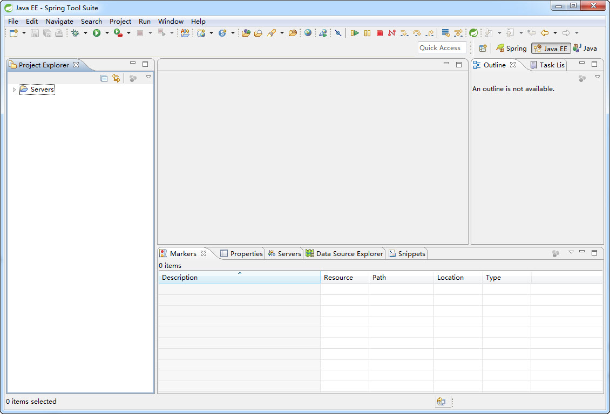

除以下提到的一些功能性设定以外，相关的界面布局，样式等可以根据个人喜好自行设定。

#### JDK设置

STS默认取安装的jre，一般建议添加配置执行本地安装的jdk，如下图配置所示：

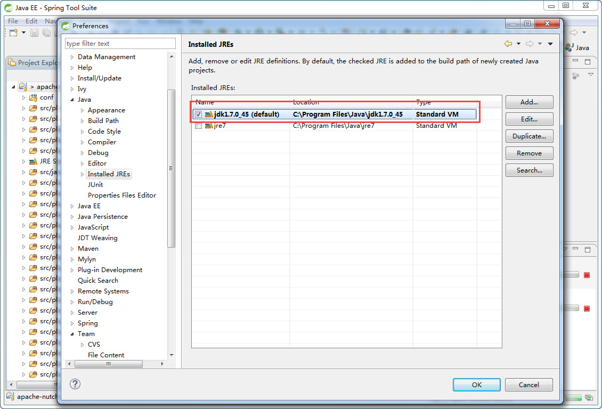

#### Apache Maven配置 

如下图打开选项配置界面，选择“Add...”按钮：

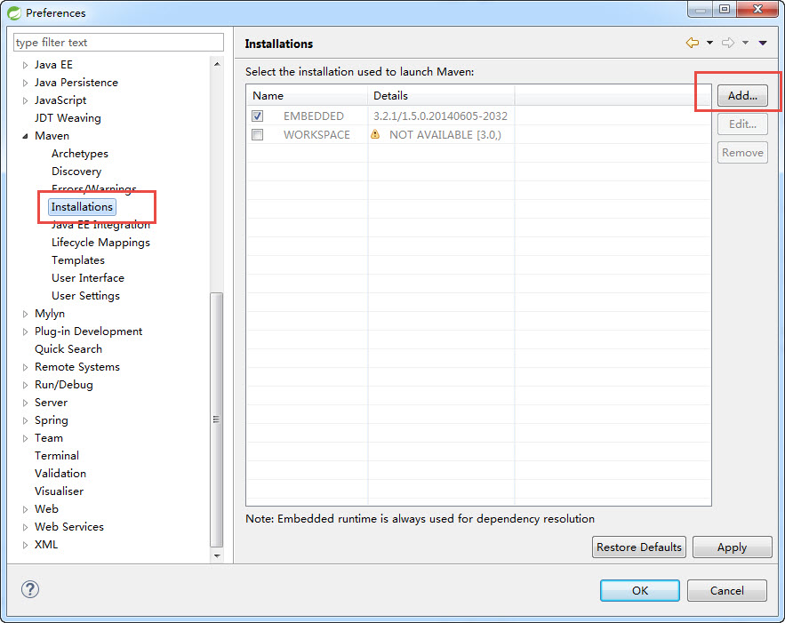

如下图浏览定位到上述安装Maven3.0.5目录，${DEV_DIR}\tools\apache-maven-3.0.5：

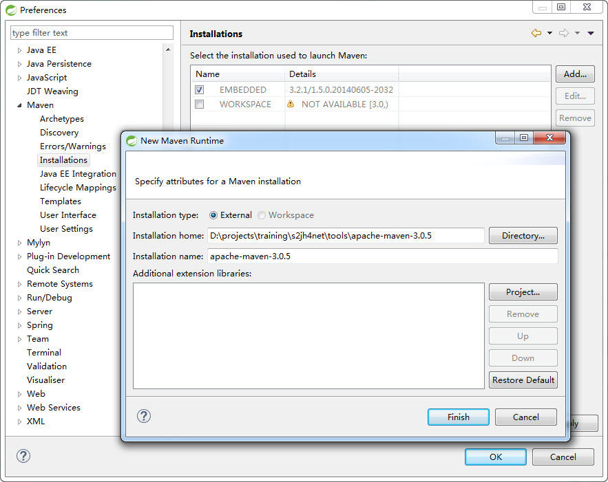

最后勾选新增的Maven配置项，点击Apply或OK：

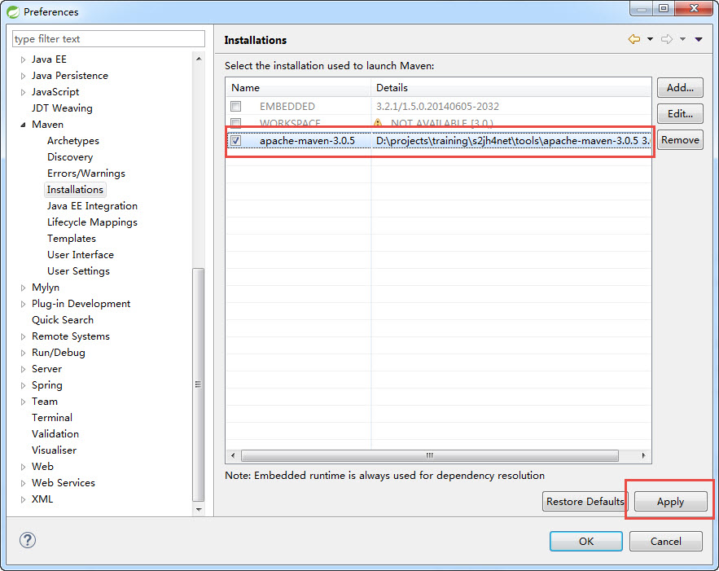

再如下图切换到“Maven”-》“User Settings”配置，浏览设定“Global Setting”到目录文件：D:\projects\training\s2jh4net\tools\apache-maven-3.0.5\conf\settings.xml，然后点击“Update Settings”按钮触发更新本地资源库目录定义：

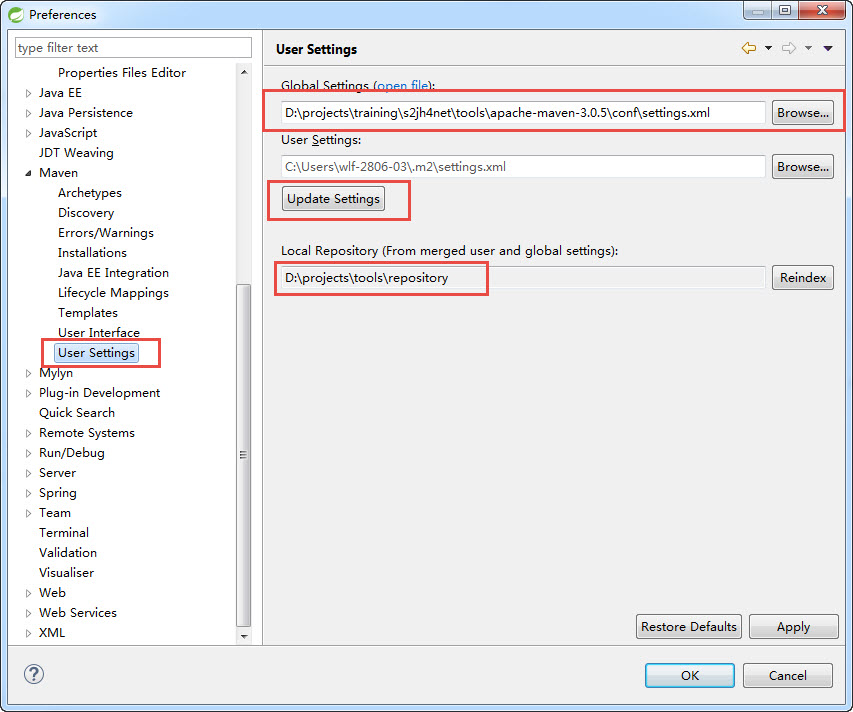

#### Lombok插件安装配置

实体对象属性定义采用了Lombok来简化繁琐的getter和setter定义，所以java源码层面就没有相关的getter和setter方法定义，因此需要安装Lombok的Eclipse插件来实现自动化增强编译输出缺少的方法定义，否则整个工程会抛出编译错误。

从 http://projectlombok.org/download.html 直接下载最新版本lombok-x.x.x.jar，注意以java -jar运行模式打开，如下图：

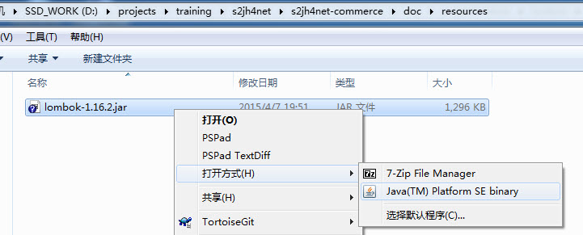

在如下程序界面定位到STS IDE目录，最后点击“Install / Update”安装插件：

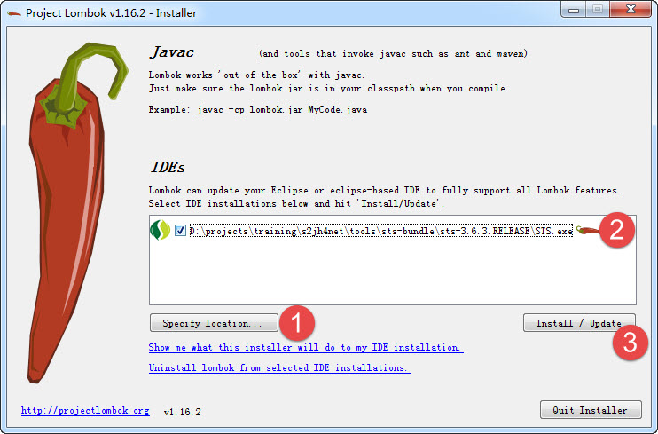

最后查看IDE的启动配置文件确认安装成功，如果有自行配置vm参数的请自行参考添加设置对应格式的参数即可：

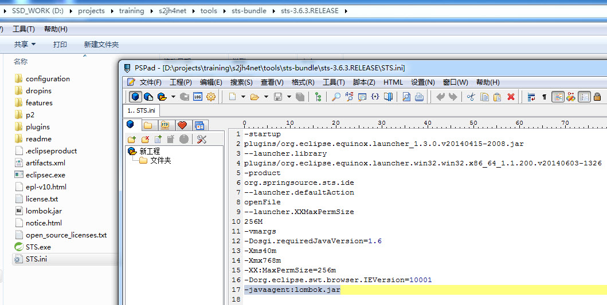

#### Eclipse Workspace参数配置

* 编码设定为UTF-8，如下图：

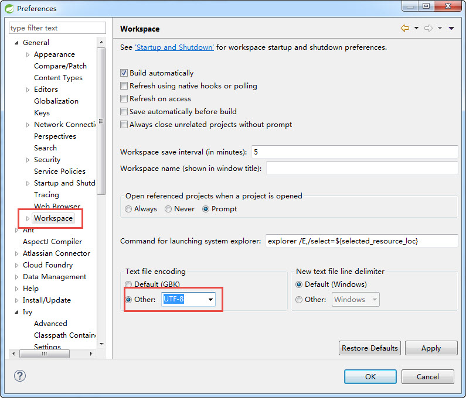

## 项目资源库获取说明

项目基于GIT进行代码托管，你可以基于熟悉的Eclipse Git插件或TortoiseGIT或其他GIT客户端工具等获取项目代码。以下基于STS已自带的git插件进行项目获取。

启动STS，菜单操作Window-》Show View-》Others，在弹出界面找到Git-》Git Repositories：


再显示的“Git Repositories”标签项，选择“Clone a Git Repository”，弹出界面选择“Clone URI”，

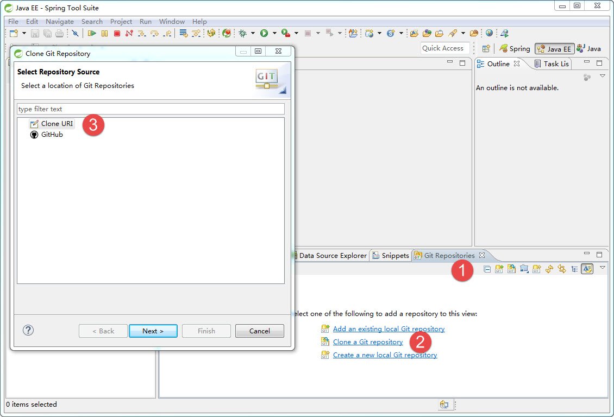

输入项目git资源库地址：https://git.oschina.net/xautlx/s2jh4net.git  ，填写自己的git平台网站的账号和密码：


下一步选取所需的代码分支，默认master。一般master是项目主干最新代码，具体其他各分支用途详见后续说明。

下一步填写资源库的存储路径，本教程为：D:\projects\training\s2jh4net\s2jh4net


## 项目导入及开发环境配置

**重要提示：**最好在上述Eclipse配置完成后再按照下述过程导入项目，避免不必要的环境配置问题导致编译异常。

### 项目导入STS工作空间

git插件clone下载整个工程目录后，在STS的Project Explorer鼠标右键点击“Import” -》“Import...”：

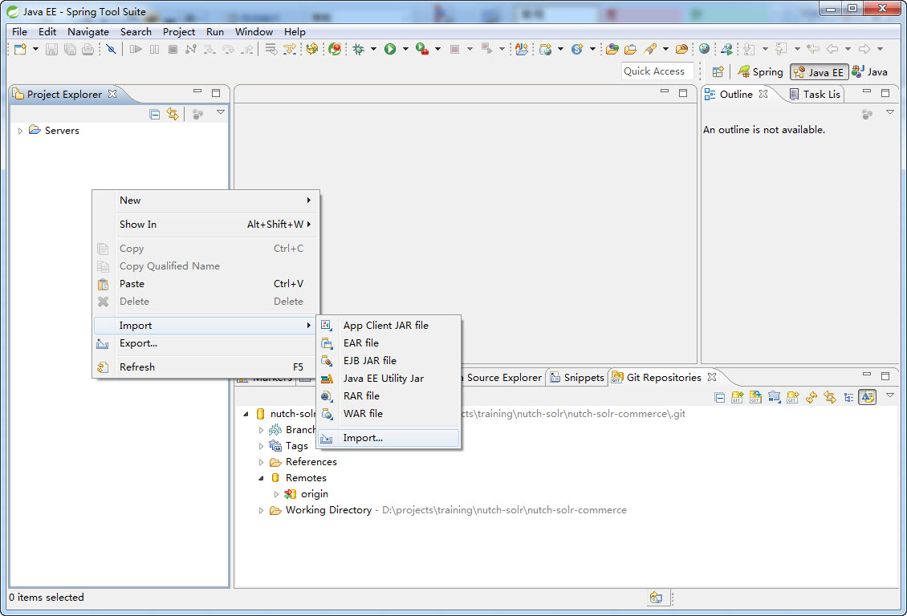


定位到：D:\projects\training\s2jh4net\s2jh4net，选择项目，然后完成导入操作：

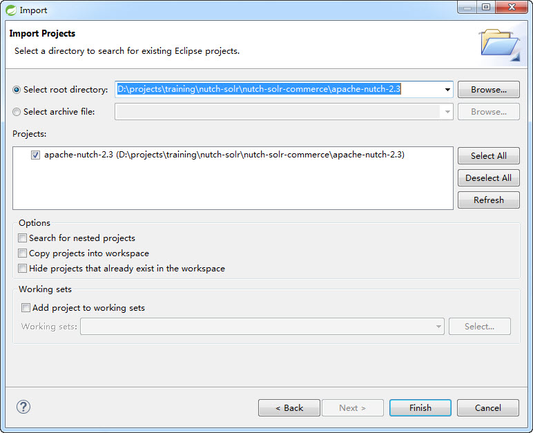

导入项目后STS应该会自动触发项目构建，同时进行Maven依赖资源的下载，此过程依据你的网速情况可能需要持续数分钟到数十分钟。在初始化自动构建完毕后，为了确保Maven执行的完整性，建议在项目的pom.xml文件上面右键执行maven install命令，如下图，正常情况能看到项目构建和单元测试运行等过程：

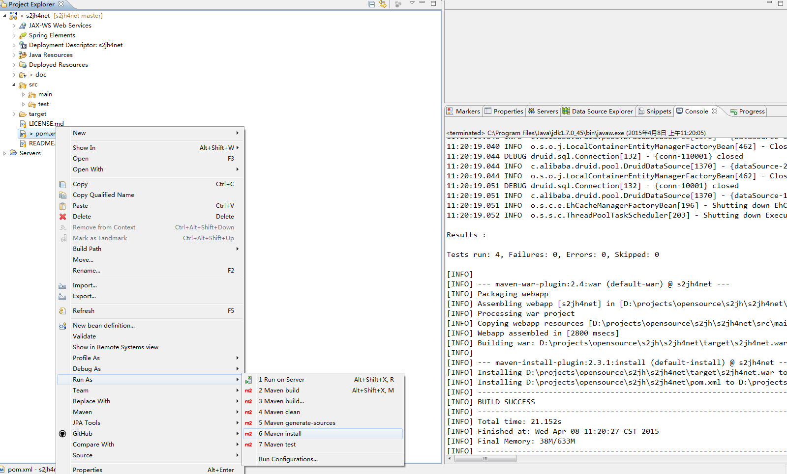

最后，如果项目依然有编译错误，请尝试对项目进行clean操作，然后refresh整个工作空间。直至整个项目没有编译错误。

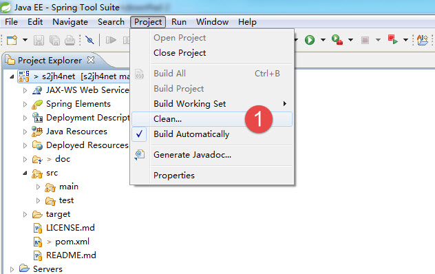

### 项目部署到Server运行

将Web项目部署到Eclipse STS自带的Server下面，然后选择Start启动服务，项目默认配置采用H2内存数据库，可以直接启动运行：

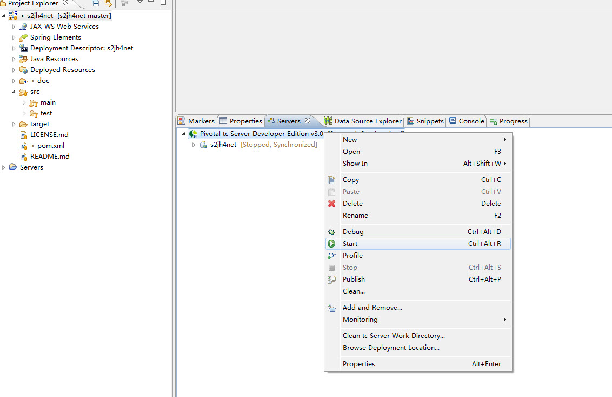

Console台可以看到整个数据库结构及基础数据初始化过程，最后出现如下界面：

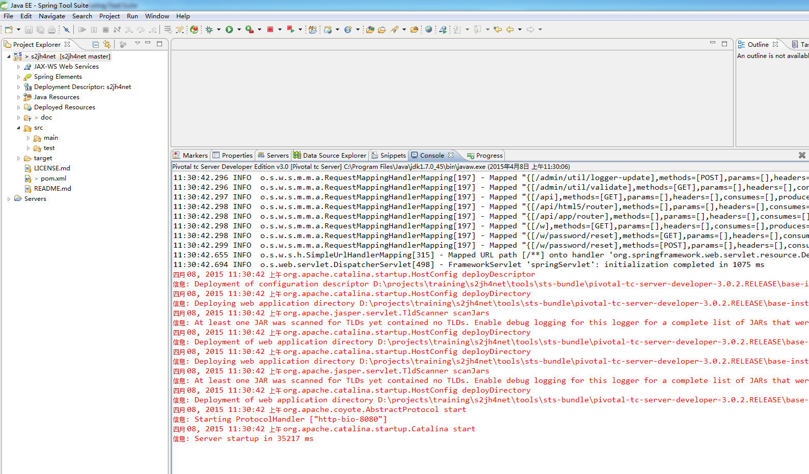

最后打开浏览器，访问 http://localhost:8080/s2jh4net ，出现默认前端首页界面， 目前 前端Web站点 | HTML5移动站点 仅作站点布局展示，暂无太多功能实现，主要原型演示请访问： http://localhost:8080/s2jh4net/admin ,admin登录界面直接点击右下方的“admin超级管理员”登录链接即可。正常情况即可正常进入管理端主界面。

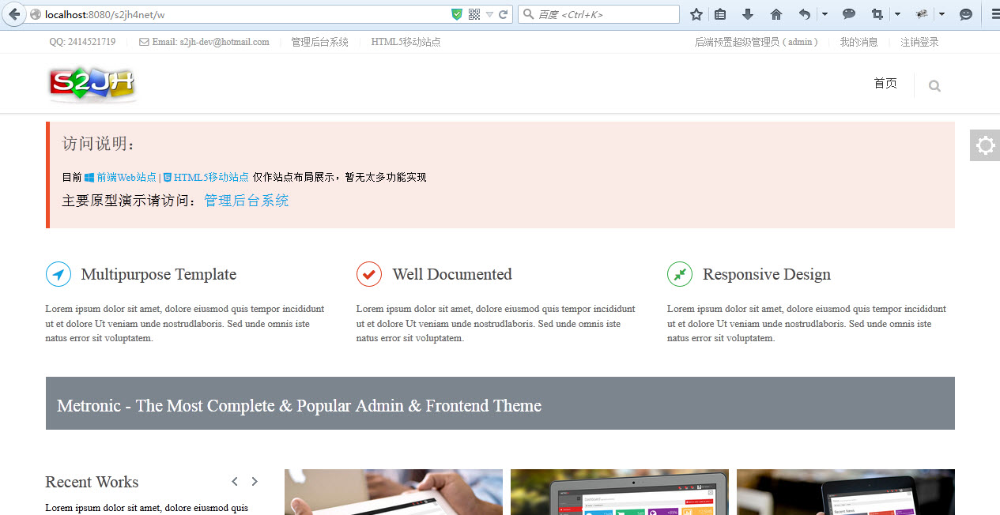

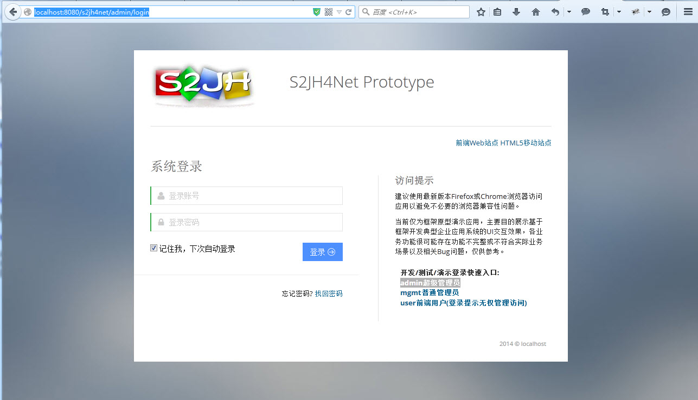

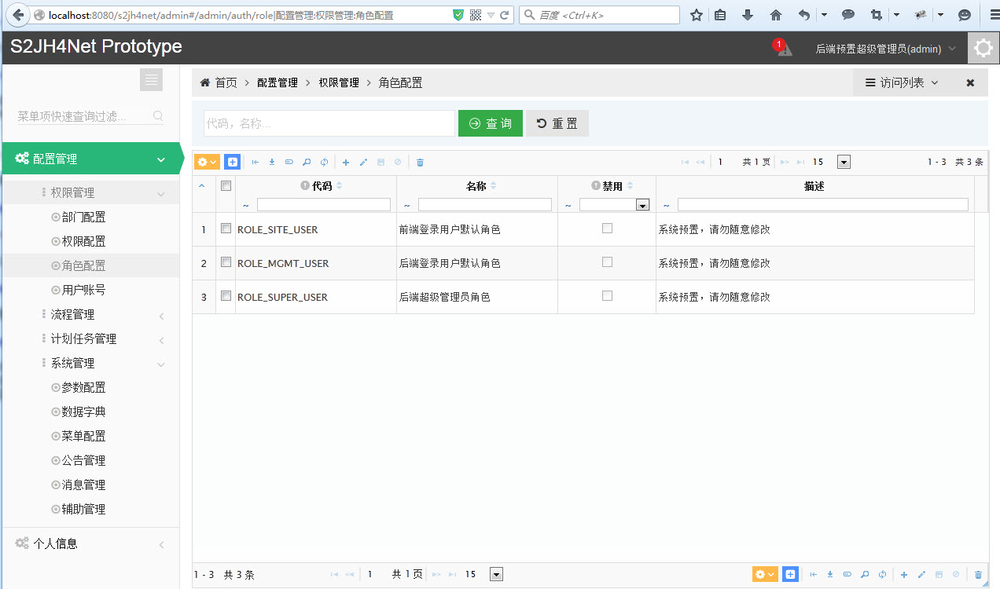

### 关于MySQL运行配置说明

* 修改application.properties或jdbc.properties文件中的jdbc_url参数值为mysql格式，例如：jdbc:mysql://127.0.0.1:3306/s2jh4net?characterEncoding=utf8